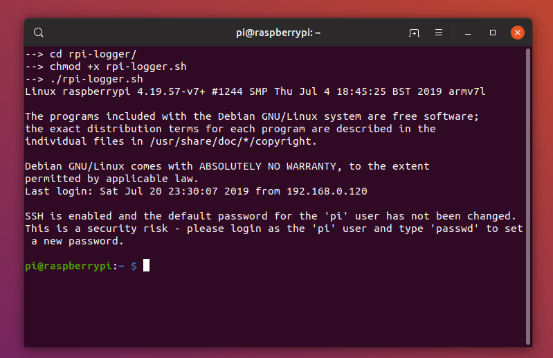
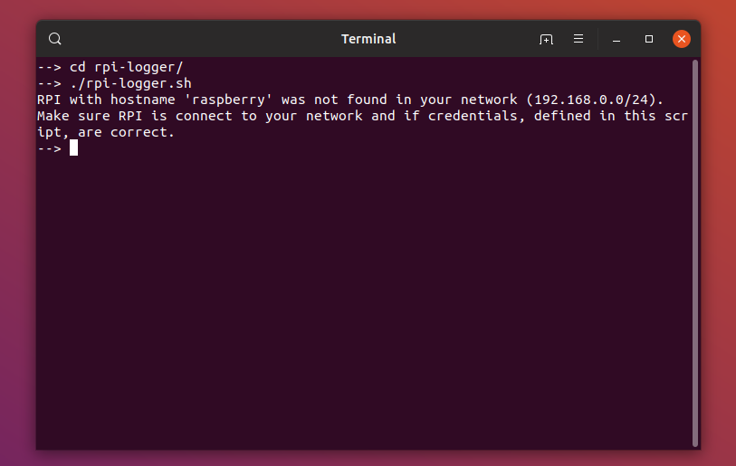

# RPI Logger
Bash script for automatic logging into RPI with SSH for developers tired of manual configuration every time they work with their RPI.

## Requirements 
Before first use make sure to have nmap, ssh, sshpass and net-tools installed.  
For proper operation You MUST provide some data about your RPI.

## Algorithm
Program execution steps:
  - check IP address of your computer (255.255.255.0 mask is assumed)
  - get network address from previously obtained IP address
  - scan network for a host with hostname given by the user
  - get IP address of RPI 
  - connect to RPI with sshpass over SSH

## Setup

1. Download repo.
2. Make sure all tools are installed.
3. Run 
```
bash add-pi.sh
```
4. Configure raspberry pi hostname, username, password, nickname and your network interface.
5. Run script:
```
bash rpi-logger.sh <nickname>
```
Where <nickname> is the same as you given during configuration step.

## Known issues

- The script is limited to networks with mask 255.255.255.0.
- It also uses plain password while logging - potential security risk.

## Screenshots
* Correct execution. 

* RPI not found. 

## Authors

* **Krzysztof Stężała** - *Initial work* - [Filesmuggler](https://github.com/filesmuggler)

## License

This project is licensed under the MIT License - see the [LICENSE.md](LICENSE.md) file for details.

## Version

* v3.0 - multiple RPI hosts supported
* v2.0 - installing script added
* v1.0 - manual credentials change

## Acknowledgments

* Hat tip to StackOverflow 🎩
* Stay hungry. Stay foolish.

